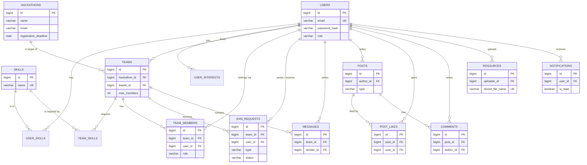

# FusionV ER diagram (Mermaid)

```mermaid
erDiagram
    USERS ||--o{ USER_SKILLS : has
    SKILLS ||--o{ USER_SKILLS : "is in"
    USERS ||--o{ USER_INTERESTS : lists
    USERS ||--o{ TEAMS : leads
    HACKATHONS ||--o{ TEAMS : "is target of"
    TEAMS ||--o{ TEAM_SKILLS : requires
    SKILLS ||--o{ TEAM_SKILLS : "is required by"
    TEAMS ||--o{ TEAM_MEMBERS : has
    USERS ||--o{ TEAM_MEMBERS : "belongs via"
    TEAMS ||--o{ JOIN_REQUESTS : receives
    USERS ||--o{ JOIN_REQUESTS : "sends / receives"
    TEAMS ||--o{ MESSAGES : contains
    USERS ||--o{ MESSAGES : writes
    USERS ||--o{ POSTS : writes
    POSTS ||--o{ POST_LIKES : "liked by"
    USERS ||--o{ POST_LIKES : gives
    POSTS ||--o{ COMMENTS : has
    USERS ||--o{ COMMENTS : writes
    USERS ||--o{ RESOURCES : uploads
    USERS ||--o{ NOTIFICATIONS : receives

    USERS { bigint id PK
            varchar email UK
            varchar password_hash
            varchar role }
    SKILLS { bigint id PK
             varchar name UK }
    HACKATHONS { bigint id PK
                 varchar name
                 varchar mode
                 date registration_deadline }
    TEAMS { bigint id PK
            bigint hackathon_id FK
            bigint leader_id FK
            int max_members }
    TEAM_MEMBERS { bigint id PK
                   bigint team_id FK
                   bigint user_id FK
                   varchar role }
    JOIN_REQUESTS { bigint id PK
                    bigint team_id FK
                    bigint user_id FK
                    varchar type
                    varchar status }
    POSTS { bigint id PK
            bigint author_id FK
            varchar type }
    POST_LIKES { bigint id PK
                 bigint post_id FK
                 bigint user_id FK }
    COMMENTS { bigint id PK
               bigint post_id FK
               bigint author_id FK }
    RESOURCES { bigint id PK
                bigint uploader_id FK
                varchar stored_file_name UK }
    MESSAGES { bigint id PK
               bigint team_id FK
               bigint sender_id FK }
    NOTIFICATIONS { bigint id PK
                    bigint user_id FK
                    boolean is_read }
```
